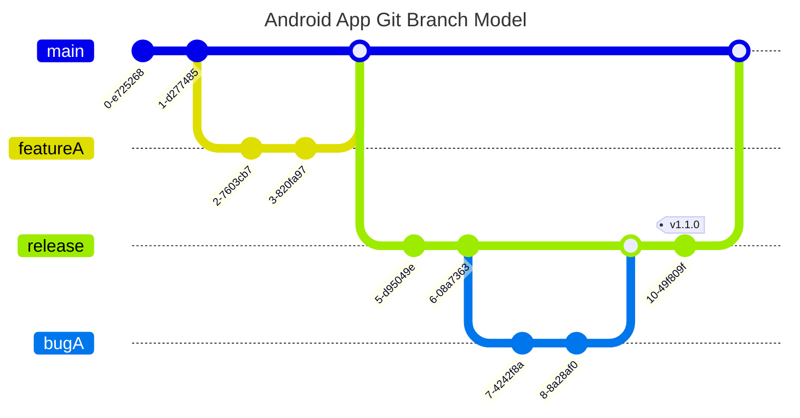

# Android-Test-App
Welcome to the test application!

This application is designed to test multiple items. That's a developer or even a technical lead, should be able to complete.
You may not be able to complete all of the steps, but that is also a part of the test itself. Some of these items will take more time than offered. So please talk through your process and let us know what you wanted to do at the end of it if you didn't have enough time to complete the work.

## Overview
This is a aeroplane application. It has a lot of aeroplanes, and it shows them all within the list. 
This application is used by our frontline staff to know what type of plane they're flying on, and what amenities is that plane has. 

## Installation

### Java

This project is currently using Java 17. You can use your preferred method of installing Java or Android Studio built in Java SDK or one of the options below. 

	
Java using SDKMAN

#### Install SDKMAN

Launch a new terminal and type in:

    $ curl -s "https://get.sdkman.io" | bash

Follow the on-screen instructions to wrap up the installation. Afterward, open a new terminal or run the following in the same shell:

    $ source "$HOME/.sdkman/bin/sdkman-init.sh"

Lastly, run the following snippet to confirm the installation's success:

    $ sdk version

You should see output containing the latest script and native versions:

    SDKMAN!
	script: 5.18.2
	native: 0.4.6

#### Installing Java

Find the latest stable Java version compatible with the project Java version specified above:

    $ sdk list java

You will see something like the following output:

    ...
    Temurin    |     | 22           | tem     |            | 22-tem
               |     | 22.0.1       | tem     |            | 22.0.1-tem
               |     | 21.0.3       | tem     |            | 21.0.3-tem
               |     | 21.0.2       | tem     |            | 21.0.2-tem
               |     | 21.0.1       | tem     |            | 21.0.1-tem
               |     | 17.0.11      | tem     |            | 17.0.11-tem
    ...

Install latest compatible version:

    $ sdk install java 17.0.11-tem
    
    Downloading: java 17.0.11-tem
    
    In progress...
    
    ######################################################################## 100.0%
    
    Installing: java 17.0.11-tem
    Done installing!

Now you will be prompted if you want this version to be set as **default**

    Do you want java 17.0.11-tem to be set as default?(Y/n)

Answering _yes_ (or _hitting enter_) will ensure that all subsequent shells opened will have this version of the SDK in use by default.

    Setting java 17.0.11-tem as default.

Refer to [SDKMAN Usage](https://sdkman.io/usage) to learn about install specific version, switching between versions and removing versions.

#### Android Studio IDE setup

1. Install the latest [Android Studio](https://developer.android.com/studio)
>[!IMPORTANT]
> Minimum required version is: Koala Feature Drop - 2024.1.2

2. Configure Android SDK by creating an `ANDROID_HOME` environment variable `export ANDROID_HOME=~/Library/Android/Sdk/` (This location is for MacOS)

## Architecture
It is very important that we make sure that we are developing to the architecture within this diagram. 

## Branch management 
It is also very important that we maintain our branch management as easy as possible. 

